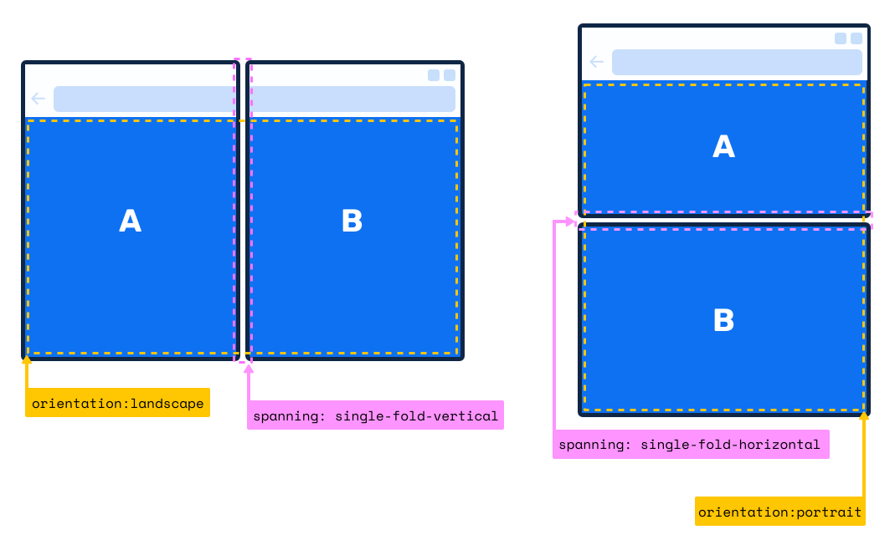
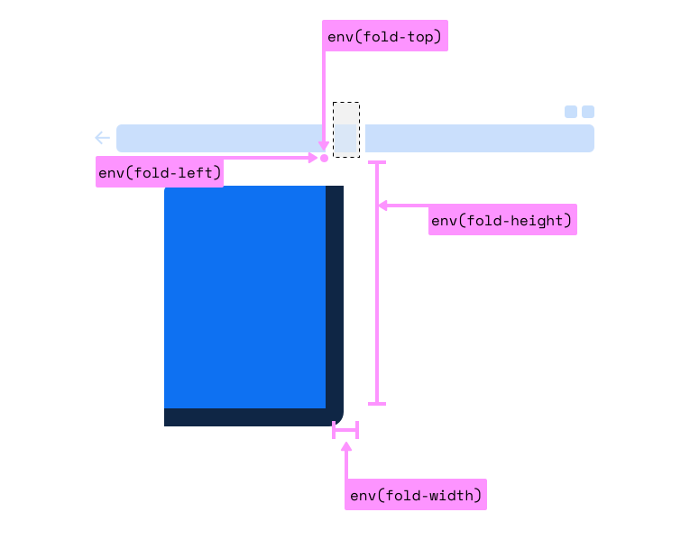
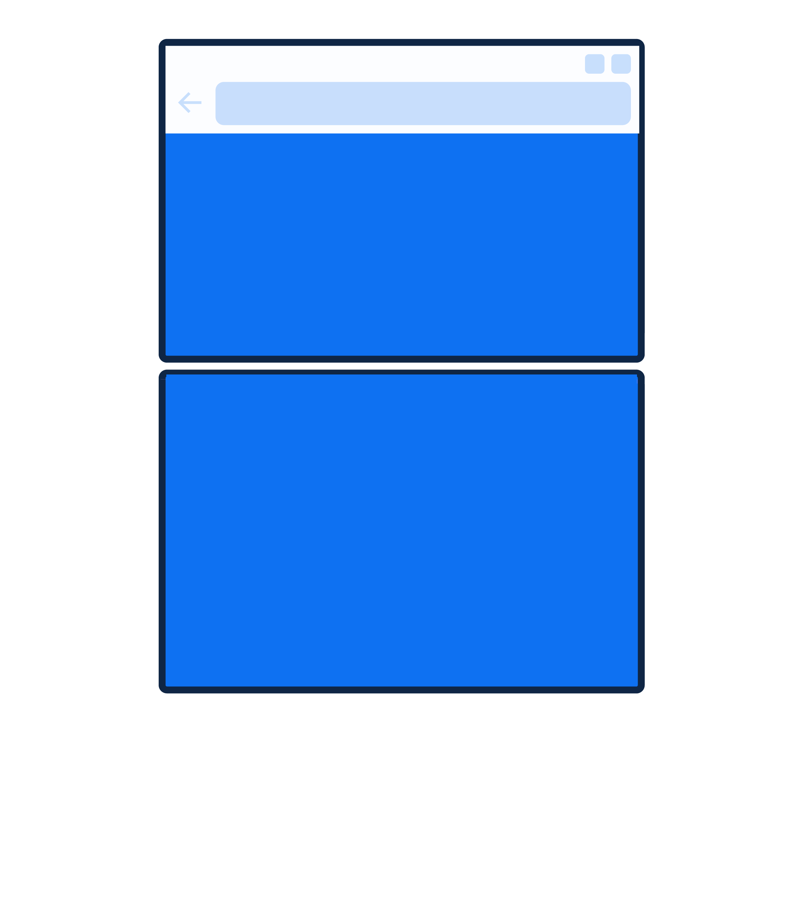
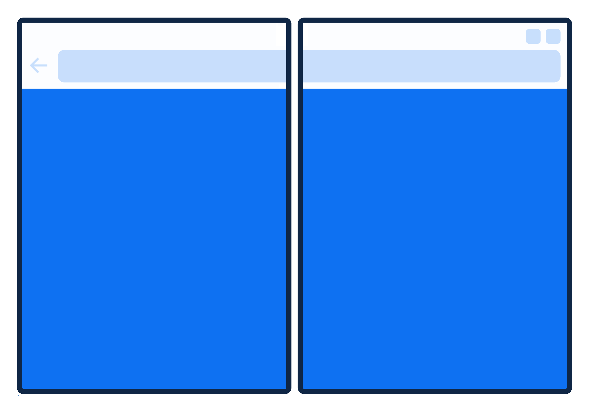
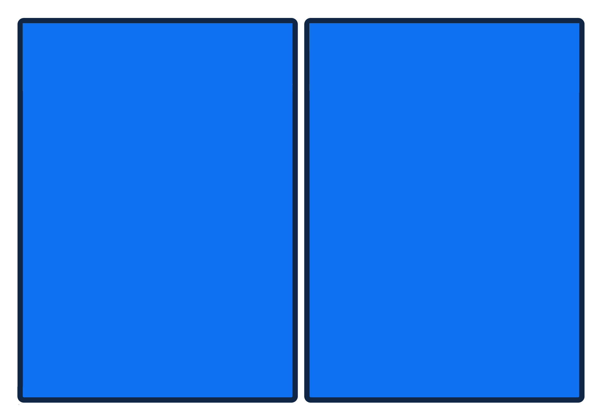
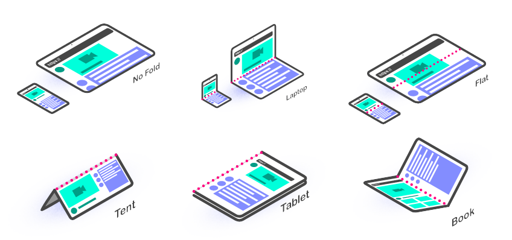

title: Angular apps for dual-screen devices with ngx-foldable
class: animation-fade
layout: true

.twitter-handle[
  @olivierleplus | @sinedied
]

<!--

Prep:
- 1 Ecran: slides
- 1 Ecran: browser edge avec devtools et demo foldable gallery, ngx-foldable
  * https://sinedied.github.io/ngx-foldable/demo/
  * https://foldable-devices.github.io/demos/battleship/build/
  * https://foldable-devices.github.io/demos/photo-gallery/build/
  * https://github.com/foldable-devices/demos
  * edge://flags/#enable-experimental-web-platform-features
  * https://sinedied.github.io/surface-duo-photo-gallery/
  * https://github.com/sinedied/ngx-foldable
- 1 Ecran: emulateur duo
- 1 Ecran: VS Code avec code demo ngx-foldable gallery sur branche before

Celui la c'est pour mon meetup Angular ;)

# Historique(s) 2min - Yohan
- Web/RD + GameWatch/Nintendo DS
* From desktop first to mobile first
* demain? foldavle first?

# Etat de l'art: c'est pas sec 2min - Olivier
* Window Segment + CSS primitives
* Device Posture
+ question dev

# Comment on dev? 10min - Yohan
- Tools/emulateurs + SETUP EMULATOR
- Polyfills / CS JSS
- Problemes
+ question dev

# NGX foldable/React 10min - Yohan
- Demo gallery app

-->

---

class: left, middle, hide-handle, primary, overlay-dark
background-image: url(./images/brick.jpg)

# .light-text.graf[Developper des applis web pour les .alt-text[foldable] devices]

<!-- .full-layer.light-text.space-left[
  .w-10.responsive[] Angular Nation
] -->

.full-layer.who.text-right.small.middle.light-text[
  .ms.responsive[]
  |
  Olivier Leplus
  |
  Yohan Lasorsa
]

???

Commentaire

---

class: center, middle, hide-handle
# Who are we?

.table.row.middle.center[
.col-2[]
.col-4.center[
  .w-70.responsive.avatar.bounceInUp.animated[]

  **Olivier Leplus**<br>
  .fab.fa-twitter[] .e[@olivierleplus]
]
.col-4.center[
  .w-70.responsive.avatar.bounceInLeft.animated[]

  **Yohan Lasorsa**<br>
  .fab.fa-twitter[] .e[@sinedied]
]
]

???

---

class: impact
## .big.book[Dual screen devices?]

---

class: contain
background-image: url(./images/gw.jpg)

---

class: impact
## .large.book[Not this one.]
## .small.book[( It's older than the web! )]

???
1982

---

class: contain
background-image: url(./images/ds-fat.jpg)

---

class: impact

.row.table.middle[
.col-1[
  .big[.big[.big.book[(]]]
]
.col-10[
## .book.bit-smaller[Still a bit wrong.]
## .small.book[This one came before the mobile web.]
]
.col-1[
  .big[.big[.big.book[)]]]
]
]

???
NDS: 2004

---

class: contain
background-image: url(./images/3ds.jpg)

???
3DS: 2010, has web browser!

---

class: contain
background-image: url(./images/duo.jpg)

???
2020

---

background-image: url(./images/new-devices-dual.jpg)

---

class: impact
## .large[So, where to begin?]


---

class: middle, center
# Another responsive design target?

.center[
  .responsive[]
]

---

class: full, middle, center, overlay-dark
background-image: url(./images/experimental.jpg)

# .large[⚠️]
# Experimental APIs ahead

---

# So, media queries it is!

```css
@media (screen-spanning: single-fold-vertical) { ... }
@media (screen-spanning: single-fold-horizontal) { ... }

```

.center[
.w-60.responsive[]
]

.full-layer.stick-bottom.space-left[
.small.no-margin[
[aka.ms/foldable/css-primitives](https://aka.ms/foldable/css-primitives)<br>[aka.ms/docs/css-primitives](https://aka.ms/docs/css-primitives)
]
]

---

# Environment variables

.center[
.w-60.responsive[]
]

---

class: middle, center
# But... things moves fast

---

class: small-handle, center
# New media queries...

.col-6.float-left.space-right[
```css
@media (horizontal-viewport-segments:2) 
and 
@media (vertical-viewport-segments:1);
```

.center[
  .w-70.responsive[]
]
]

.col-6.float-left[
```css
@media (horizontal-viewport-segments:1) 
and 
@media (vertical-viewport-segments:2);
```

.center[
  .w-70.responsive[]
]
]

--

.full-layer.stick-bottom.space-left[
.small.no-margin.margin-left[
*With new env vars soon: https://github.com/w3c/csswg-drafts/pull/6474/*
]
]

---

class: small-handle,center
# ...opening up new possibilities?
```css
@media (horizontal-viewport-segments:2) and @media (vertical-viewport-segments:2);
```

--
  .w-30.responsive[]
  <br />
--
  .w-30.up.responsive[]

---

class: impact
## .large[What about the JavaScript side?]

---

# Window Segments API

.full-layer.stick-bottom.space-left[
.small.no-margin.text-left.margin-left[
[aka.ms/foldable/window-segments](https://aka.ms/foldable/window-segments)<br>[aka.ms/docs/window-segments](https://aka.ms/docs/window-segments)
]
]

```js
const screenSegments = window.getWindowSegments();
```

--

<br>

.center.large[
  👆 *But that was before community feedback...*
]

---

# Visual Viewport Window Segments API

.full-layer.stick-bottom.space-left[
.small.no-margin.text-left.margin-left[
[aka.ms/foldable/window-segments](https://aka.ms/foldable/window-segments)<br>[aka.ms/docs/window-segments](https://aka.ms/docs/window-segments)
]
]

```js
const screenSegments = window.visualViewport.segments;
```

---

# Visual Viewport Window Segments API

.full-layer.stick-bottom.space-left[
.small.no-margin.text-left.margin-left[
[aka.ms/foldable/window-segments](https://aka.ms/foldable/window-segments)<br>[aka.ms/docs/window-segments](https://aka.ms/docs/window-segments)
]
]

```js
const screenSegments = window.visualViewport.segments; // => null || DOMRect[]

if (screenSegments.length > 1) {
  // It's a foldable device !


}
```

---

# Visual Viewport Window Segments API

.full-layer.stick-bottom.space-left[
.small.no-margin.text-left.margin-left[
[aka.ms/foldable/window-segments](https://aka.ms/foldable/window-segments)<br>[aka.ms/docs/window-segments](https://aka.ms/docs/window-segments)
]
]

```js
const screenSegments = window.visualViewport.segments; // => null || DOMRect[]

if (screenSegments.length > 1) {
  // It's a foldable device !
  for (let i = 0; i < screenSegments.length; i++) {
    console.log(`Screen segment ${i}:`);
    console.log('- width   : ' + screenSegments[i].width);
    console.log('- height  : ' + screenSegments[i].height);
    console.log('- x origin: ' + screenSegments[i].x);
    console.log('- y origin: ' + screenSegments[i].y);
  }
}
```

--

.full-layer.text-right.space-right[
  <div style="height: 7em"></div>
  .w-20.responsive[]
]

---

class: small-handle
# Device Posture API
### [w3.org/TR/device-posture/](https://w3.org/TR/device-posture/)

.full-layer.right.space-right[
.w-30.responsive[]
]

- **Device**: single-screen (foldable or not), dual-screen
- **Posture**: no-fold, laptop, flat, tent, tablet, book

.center[
.w-70.responsive[]
]

---

# Device Posture API

```js
navigator.devicePosture.addEventListener("change", () => {
  console.log(`The current posture is: ${navigator.devicePosture.type}!`);
})
```

---

# Device Posture API

```js
navigator.devicePosture.addEventListener("change", () => {
  console.log(`The current posture is: ${navigator.devicePosture.type}!`);
})
```

```css
@media (device-posture: laptop) and (screen-spanning: single-fold-horizontal) {
  /* Where the magic happens! */
}
```

.center[
.w-30.responsive[]
]

---

class: impact, alt
## .large[Demos]

???

- ngx-foldable demo
- gallery app
- battleship

---

class: impact
## .large[Setting up for development]

---

# Enable browser dual-screen emulation
### [aka.ms/foldable/dev-setup](aka.ms/foldable/dev-setup)

1. `chrome://flags` or `edge://flags`
2. Enable **Experimental Web Platform features**
3. Open dev tools settings
4. In **Experiments** tab, tick **Emulation: Support dual screen mode**

.center[
  .w-70.responsive[]
]

---

# Android Surface Duo emulator
### [aka.ms/foldable/dev-setup](https://aka.ms/foldable/dev-setup)

.center[
  .w-90.responsive[]
  ### ⚠️ *Highly recommended!*
]

---

exclude: true
class: impact
## .large[About polyfills...]

---

exclude: true
class: contain, small-handle
background-image: url(./images/polyfills.jpg)

---

class: center
# About polyfills...

<br>

| Feature | Implementation | Polyfill
|----------------|:-----------------:|:---:|
| CSS Spanning | ✅ 🧪 | ✅ |
| Window Segments | ✅ 🧪 | ✅ |
| Device Posture | ⛔ | ✅ ✋ |
| CSS Viewport Window Segments | ⛔ | ⛔ |

---

class: middle, hide-handle

.big-text.no-bg.baseline[
```js
const end = {
  message: 'Thank you!',
  slides : 'bit.ly/foldable-slides',
  links  : 'aka.ms/foldable-dev'
};

alert('Questions?');
```
]

<hr class="hr-right more-space">
.right.large[
.large.em-text[{]
.fab.fa-twitter[]
.large.em-text[}] .e[@olivierleplus] .em-text[|] .e[@sinedied]
]
