title: Create multi-screen experiences for the new mobile web
class: animation-fade
layout: true

.twitter-handle[
  @olivierleplus
]

<!--

# Historique(s) 5min - Yohan
- Web/RD + GameWatch/Nintendo DS
* From desktop first to mobile first
* demain? foldavle first?

# Etat de l'art: c'est pas sec 5min - Olivier
* Window Segment + CSS primitives
* Device Posture
+ question dev

# Demo: plouf 10min - Olivier
Vanilla HTML/JS/CSSx

# UI/patterns 5min / tous les 2 / images
* discussion? qu'est ce que vous avez en tete?
 * list/detail
 * 1 ecran a la fois
 * twitch + comments
 * jeux videos/MK/bataille navale
+ question dev

# Comment on dev? 10min - Yohan
- Tools/emulateurs + SETUP EMULATOR
- Polyfills / CS JSS
- Problemes
+ question dev

# NGX foldable/React 10min - Yohan
- Demo gallery app

-->

---

exclude: true
class: left, hide-handle, middle, overlay-grey2
background-image: url(images/broken.jpg)

.title-new[
# .light-text[J'ai plié mon smartphone et<br>il ne s'est pas cassé...]
.space-top[# .alt-text.bit-larger[...mais mon app si 🙁]]
<br>
]

.full-layer.bottom.space-left[
.w-15.responsive[]
]

.full-layer.who.text-right.small.middle.light-text[
  Olivier Leplus
]

---

class: left, hide-handle, middle, overlay-grey
background-image: url(images/windows.jpg)

.title-new[
# .light-text.bit-larger[Create multi-screen experiences]
.space-top[# .alt-text.bit-larger[For the new mobile web]]
<br>
]


.full-layer.who.text-right.small.middle.light-text[
  @olivierleplus
]


---

class: center, middle, hide-handle
# Who am I?

.table.row.middle[
.col-4.center[
  .w-70.responsive.avatar.tada.animated[]
]
.col-8.bit-larger.left[
  .e[Olivier Leplus]<br>
  .bit-larger[\[ DevRel - .mini-img[ Microsoft] \]]<br>
  .small.em-text[GDE Web, Geek, Community lover]<br>
]
]
.center.bit-larger[
.large.em-text[{]
.fab.fa-twitter[]
.large.em-text[}] .e[@olivierleplus]<br>
]


---

exclude: true
class: center, middle, hide-handle
# Who are we?

.table.row.middle.center[
.col-2[]
.col-4.center[
  .w-70.responsive.avatar[]

  **Yohan Lasorsa**<br>
  .fab.fa-twitter[] .e[@sinedied]
]
.col-4.center[
  .w-70.responsive.avatar[]

  **Olivier Leplus**<br>
  .fab.fa-twitter[] .e[@olivierleplus]
]
]

.large[👉 [aka.ms/foldable-feedback](https://aka.ms/foldable-feedback) 👈]

---

class: impact
## .large[Dual screen devices?]

---

class: contain, middle
background-image: url(./images/gw.jpg)

--
# .large[1982]

---

class: contain, middle
background-image: url(./images/ds-fat.jpg)

???
tactile!

--
# .large[2004]

---

class: contain, middle
background-image: url(./images/3ds.jpg)

--
# .large[2010]

???
3DS: 2010, has web browser!

---

class: contain
background-image: url(./images/duo.jpg)

???
2020

---

background-image: url(./images/new-devices-dual.jpg)

---

class: impact
## .large[So, where to begin?]

---

class: middle, center
# Another responsive design target?

.center[
  .responsive[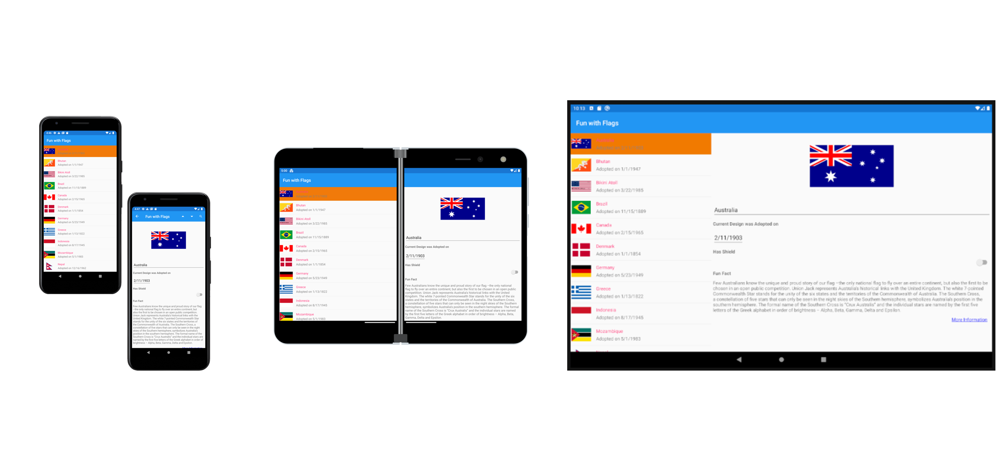]
]

---

class: full, middle, center, overlay-dark
background-image: url(./images/experimental.jpg)

# .large[⚠️]
# Experimental APIs ahead

---

class: small-handle
# So, media queries it is!

```css
@media (screen-spanning: single-fold-vertical) { ... }
@media (screen-spanning: single-fold-horizontal) { ... }

```

.center[
  .w-60.responsive[]
]

.full-layer.stick-bottom.space-left[
.small.no-margin[
[aka.ms/foldable/css-primitives](https://aka.ms/foldable/css-primitives)<br>[aka.ms/docs/css-primitives](https://aka.ms/docs/css-primitives)
]
]

---

class: middle, center
# But... things moves fast

---

class: small-handle, center
# New media queries...

.col-6.float-left.space-right[
```css
@media (horizontal-viewport-segments:2) 
and 
@media (vertical-viewport-segments:1);
```

.center[
  .w-70.responsive[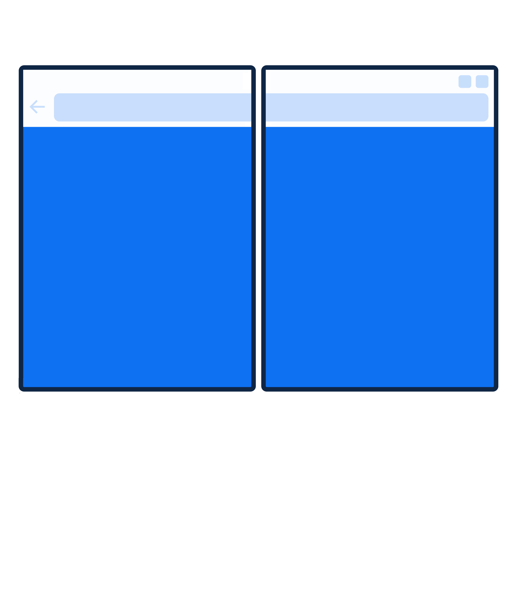]
]
]

.col-6.float-left[
```css
@media (horizontal-viewport-segments:1) 
and 
@media (vertical-viewport-segments:2);
```

.center[
  .w-70.responsive[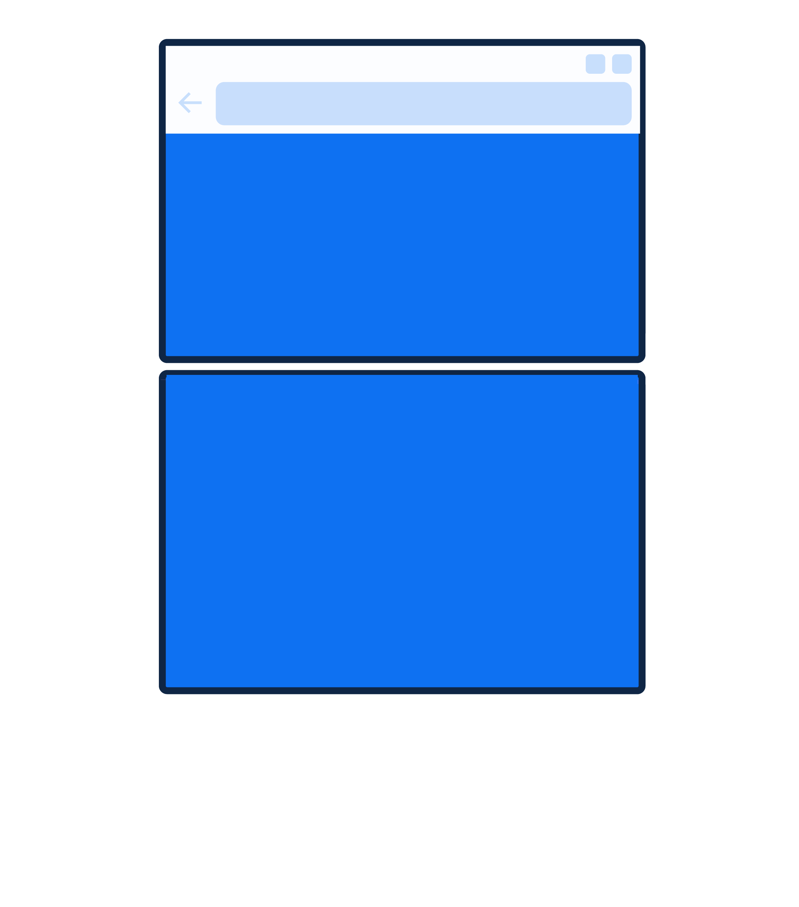]
]
]

---

class: small-handle, center

# ...Opening up new possibilities?
```css
@media (horizontal-viewport-segments:2) and @media (vertical-viewport-segments:2);
```

--
.center.no-margin[
  .w-30.responsive[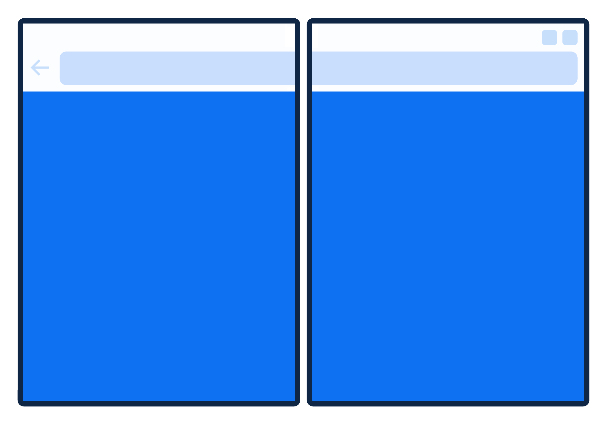]
]
--
.center.no-margin[
  .w-30.up.responsive[]
]

---

class: impact
## .large[Let's play a game]

---

```css
@media (horizontal-viewport-segments: 2) {
  body { 
    background-color: yellow; 
  }
}
```
.center[
.responsive[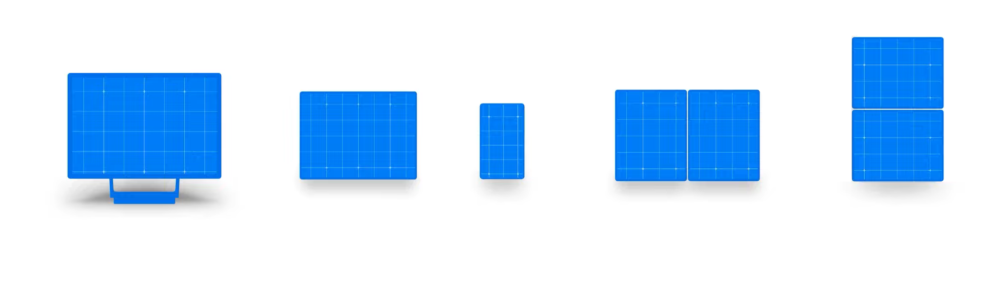]
]

---

```css
@media (horizontal-viewport-segments: 2) {
  body { 
    background-color: yellow; 
  }
}
```

.center[
  .responsive[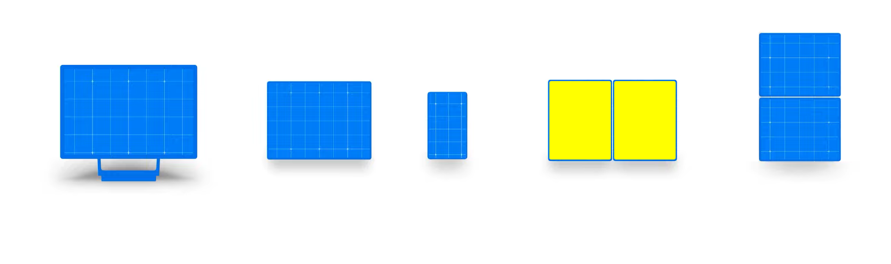]
]

---

# Environment variables

```css
env(viewport-segment-width <x> <y>);
env(viewport-segment-height <x> <y>);
env(viewport-segment-top <x> <y>);
env(viewport-segment-left <x> <y>);
env(viewport-segment-bottom <x> <y>);
env(viewport-segment-right <x> <y>);
```

.center[
.w-60.responsive[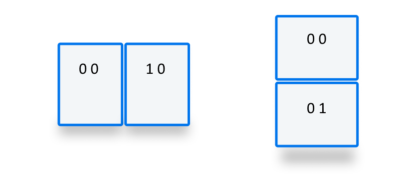]
]

---

class: impact
## .large[What about the JavaScript side?]

---

# Window Segments API

.full-layer.stick-bottom.space-left[
.small.no-margin.text-left.margin-left[
[aka.ms/foldable/window-segments](https://aka.ms/foldable/window-segments)<br>[aka.ms/docs/window-segments](https://aka.ms/docs/window-segments)
]
]

```js
const screenSegments = window.getWindowSegments();
```

--

<br>

.center.large[
  👆 *But that was before community feedback...*
]

---

# Visual Viewport Window Segments API

.full-layer.stick-bottom.space-left[
.small.no-margin.text-left.margin-left[
[aka.ms/foldable/window-segments](https://aka.ms/foldable/window-segments)<br>[aka.ms/docs/window-segments](https://aka.ms/docs/window-segments)
]
]

```js
const screenSegments = window.visualViewport.segments;
```

---

# Visual Viewport Window Segments API

.full-layer.stick-bottom.space-left[
.small.no-margin.text-left.margin-left[
[aka.ms/foldable/window-segments](https://aka.ms/foldable/window-segments)<br>[aka.ms/docs/window-segments](https://aka.ms/docs/window-segments)
]
]

```js
const screenSegments = window.visualViewport.segments; // => null || DOMRect[]

if (screenSegments.length > 1) {
  // It's a foldable device !


}
```

---

# Visual Viewport Window Segments API

.full-layer.stick-bottom.space-left[
.small.no-margin.text-left.margin-left[
[aka.ms/foldable/window-segments](https://aka.ms/foldable/window-segments)<br>[aka.ms/docs/window-segments](https://aka.ms/docs/window-segments)
]
]

```js
const screenSegments = window.visualViewport.segments; // => null || DOMRect[]

if (screenSegments.length > 1) {
  // It's a foldable device !
  for (let i = 0; i < screenSegments.length; i++) {
    console.log(`Screen segment ${i}:`);
    console.log('- width   : ' + screenSegments[i].width);
    console.log('- height  : ' + screenSegments[i].height);
    console.log('- x origin: ' + screenSegments[i].x);
    console.log('- y origin: ' + screenSegments[i].y);
  }
}
```

--

.full-layer.text-right.space-right[
  <div style="height: 7em"></div>
  .w-20.responsive[]
]

---

# .small[`window.visualViewport.segments` is immutable]

.no-margin[
```js

window.addEventListener("resize") => {
  const segments = window.visualViewport.segments;
  console.log(segments.length);
}
```
]
.center.no-margin[
  .w-90.responsive[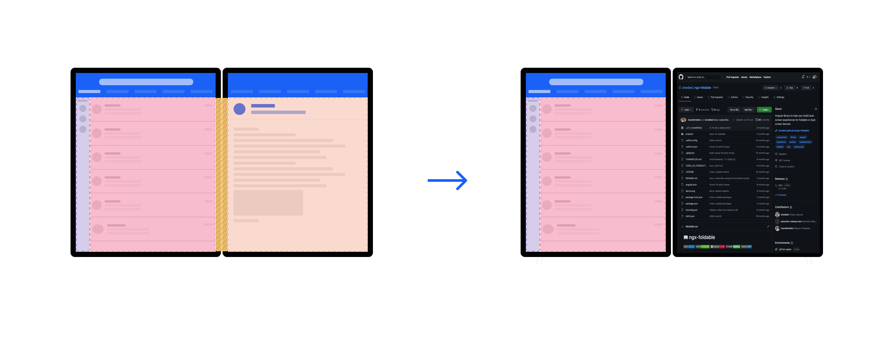]
]

---

# A little bit of gym 🤸‍♀️

.center[
  .w-90.responsive[]
]

---

# Device Posture API
### [w3.org/TR/device-posture/](https://w3.org/TR/device-posture/)

- **Device**: single-screen (foldable or not), dual-screen
- **Posture**: no-fold, laptop, flat, tent, tablet, book

.center[
.w-40.responsive[]
]

---

# Device Posture API

```js
navigator.devicePosture.addEventListener("change", () => {
  console.log(`The current posture is: ${navigator.devicePosture.type}!`);
})
```

---

# Device Posture API

```js
navigator.devicePosture.addEventListener("change", () => {
  console.log(`The current posture is: ${navigator.devicePosture.type}!`);
})
```

```css
@media (device-posture: laptop) and (vertical-viewport-segments:2) {
  /* Where the magic happens! */
}
```

.center[
.w-30.responsive[]
]

---

class: impact, alt
## .large[Demos]

???
- demo Olivier
- ngx-foldable demo
- gallery app
- battleship

---

class: impact
## .larger[What about UI/UX?]

---

class: middle, center
# Design patterns? 🤔

???
Quelles sont vos idées?

---

class: center
# List / details

.center[
  .w-60.responsive[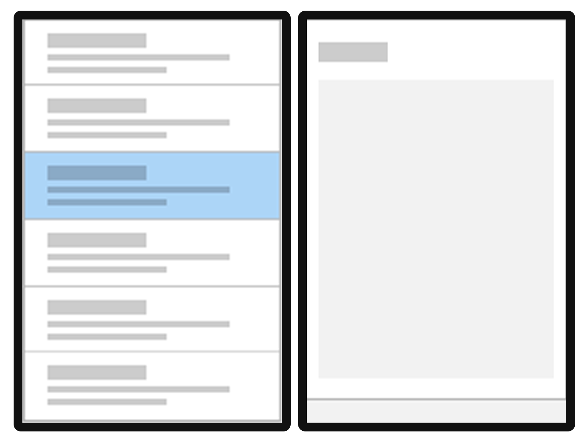]
]

---

class: center
# Companion pane

.center[
  .w-35.responsive[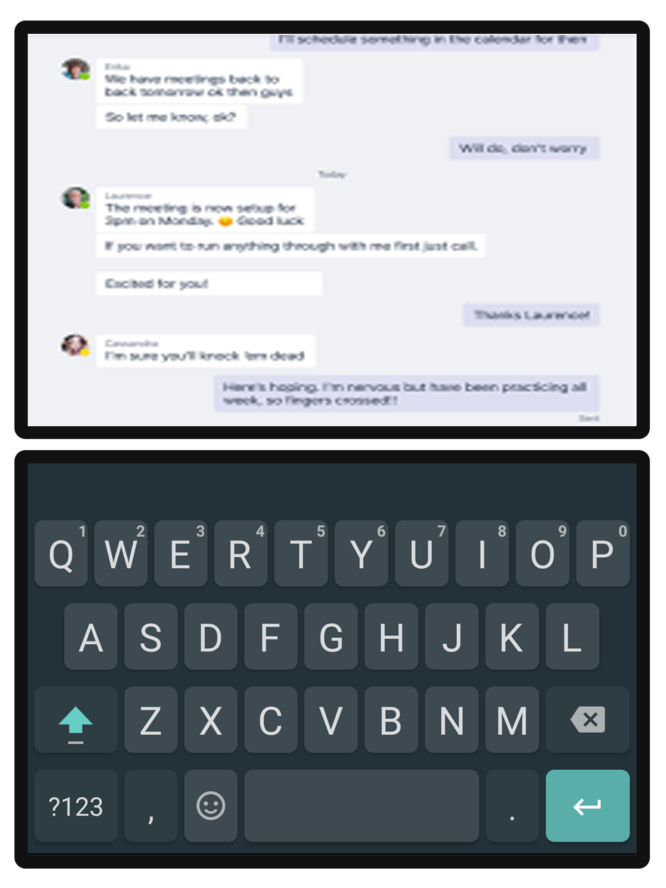]
]

???

- 1 screen to view content
- 1 screen to interact with it

Twitch + comments, keyboard...

---

class: center
# Dual view

.center[
  .w-45.responsive[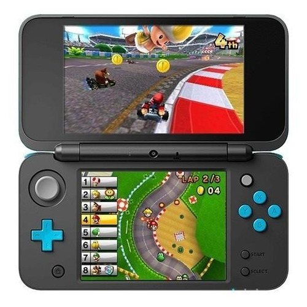]
]

???
Batteleship (Mine+yours), Mario kart (main+map)

---

class: center
# Dual view interaction

.center[
  .w-60.responsive[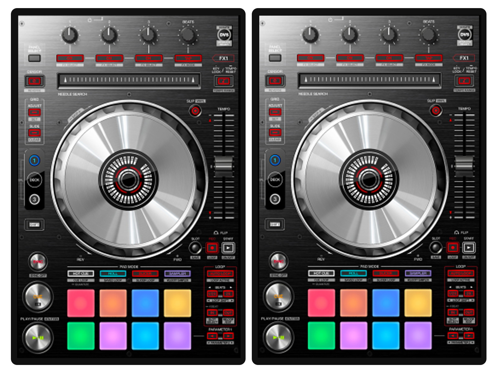]
]

???
2 DJ mixers

---

class: impact
## .large[Setting up for development]

---

# Enable browser dual-screen emulation
### [aka.ms/foldable/dev-setup](https://aka.ms/foldable/dev-setup)

1. `chrome://flags` or `edge://flags`
2. Enable **Experimental Web Platform features**
3. Open dev tools settings
4. In **Experiments** tab, tick **Emulation: Support dual screen mode**

.center[
  .w-70.responsive[]
]

---

# Android Surface Duo emulator
### [aka.ms/foldable/dev-setup](https://aka.ms/foldable/dev-setup)

.center[
  .w-90.responsive[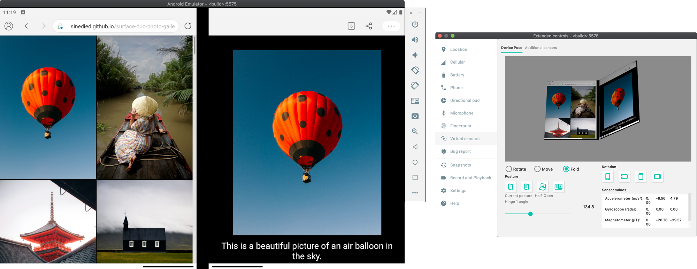]
  ### ⚠️ *Highly recommended!*
]

---

class: impact
## .large[About polyfills...]

---

class: contain, small-handle
background-image: url(./images/polyfills.jpg)

---

class: center
# Current polyfills status

<br>

| Feature | Implementation | Polyfill
|----------------|:-----------------:|:---:|
| CSS Spanning | ⛔ 🚮 | ✅ |
| Window Segments (old) | ⛔ 🚮 | ✅ |
| Device Posture | ✅ 🧪 | ✅ ✋ |
| CSS Viewport Window Segments | ✅ 🧪 | ⛔ |
| Window Segments (new) | ✅ 🧪 | ⛔ |

---

exclude: true
class: full, middle, center
background-image: url(./images/dive2.jpg)

# Let's dive in!

???

- ngx-foldable github page
- Gallery app source code

---

class: middle, hide-handle

.big-text.no-bg.baseline[
```js
const end = {
  message : 'Thank you!',
  slides  : 'bit.ly/foldable-dev',
  links   : 'aka.ms/foldable-dev'
};

alert('Questions?');
```
]

<hr class="hr-right more-space">
.right.large[
.large.em-text[{]
.fab.fa-twitter[] .fab.fa-github[] .fab.fa-youtube[]
.large.em-text[}] .e[@olivierleplus]
]

---

exclude: true


# Links

- https://docs.microsoft.com/en-us/dual-screen/web/css-media-spanning
- https://docs.microsoft.com/en-us/dual-screen/web/javascript-getwindowsegments
- https://docs.microsoft.com/en-us/dual-screen/web/emulator-device-testing
- https://docs.microsoft.com/en-us/dual-screen/web/desktop-developer-tools

